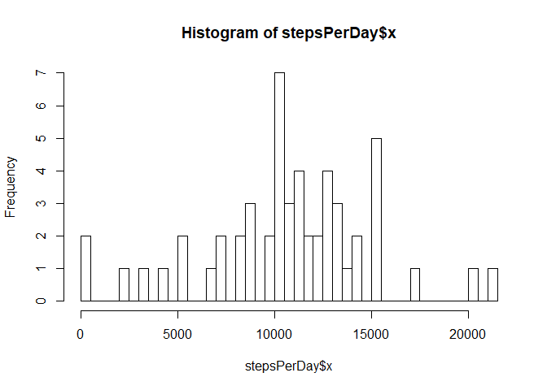
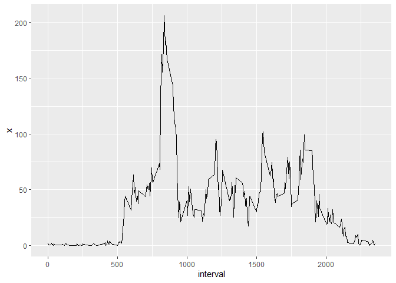
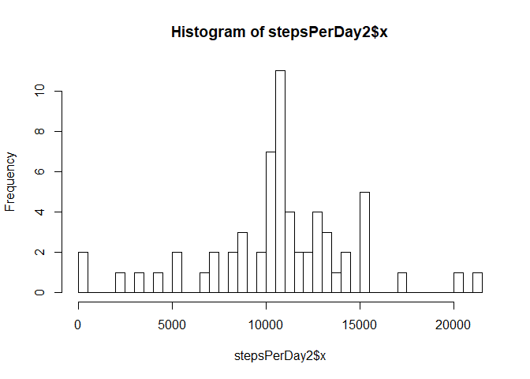
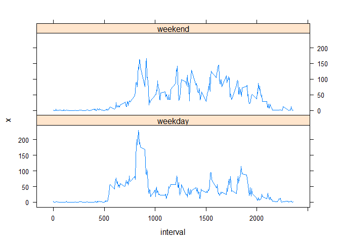

## Loading and preprocessing the data analysis

1. Load the data (i.e. `read.csv()`)


```r
unzip("activity.zip")
df <- read.csv("activity.csv", colClasses = c("integer", "Date", "integer"))
```

2. Process/transform the data (if necessary) into a format suitable for your analysis

* *There is no need of any further pre-processing. All required data transformation is done by the read.csv() function.*

## What is mean total number of steps taken per day?

1. Make a histogram of the total number of steps taken each day


```r
stepsPerDay <- aggregate(df$steps, list(dt=df$date), sum)
hist(stepsPerDay$x, breaks=50)
```

<!-- -->

2. Calculate and report the **mean** and **median** total number of steps taken per day


```r
cat(mean(stepsPerDay$x, na.rm = TRUE))
```

```
## 10766.19
```

```r
cat(median(stepsPerDay$x, na.rm = TRUE))
```

```
## 10765
```

## What is the average daily activity pattern?

1. Make a time series plot (i.e. `type = "l"`) of the 5-minute interval (x-axis) and the average number of steps taken, averaged across all days (y-axis)


```r
avgSteps <- aggregate(df$steps, list(interval=df$interval), FUN=mean, na.rm=TRUE)
library(ggplot2)
ggplot(avgSteps, aes(interval, x)) + geom_line()
```

<!-- -->

2. Which 5-minute interval, on average across all the days in the dataset, contains the maximum number of steps?


```r
cat(subset(avgSteps, x == max(avgSteps$x))$interval)
```

```
## 835
```

## Imputing missing values

1. Calculate and report the total number of missing values in the dataset (i.e. the total number of rows with `NA`s)


```r
cat(sum(!complete.cases(df)))
```

```
## 2304
```

2. Devise a strategy for filling in all of the missing values in the dataset.

* *I decided to use the mean for that that 5-minute interval.*

3. Create a new dataset that is equal to the original dataset but with the missing data filled in.


```r
merged <- merge(df, avgSteps, by="interval")
missing <- is.na(merged$steps)
merged[missing, ]$steps <- merged[missing, ]$x
imputed <- merged[c("steps", "date", "interval")]
```

4. Make a histogram of the total number of steps taken each day...


```r
stepsPerDay2 <- aggregate(imputed$steps, list(imputed=imputed$date), sum)
hist(stepsPerDay2$x, breaks=50)
```

<!-- -->

&nbsp;&nbsp;&nbsp;&nbsp;&nbsp;&nbsp;&nbsp;&nbsp;&nbsp;
...and Calculate and report the **mean** and **median** total number of steps taken per day.

```r
cat(mean(stepsPerDay2$x))
```

```
## 10766.19
```

```r
cat(median(stepsPerDay2$x))
```

```
## 10766.19
```

&nbsp;&nbsp;&nbsp;&nbsp;&nbsp;&nbsp;&nbsp;&nbsp;&nbsp;
...Do these values differ from the estimates from the first part of the assignment? What is the impact of imputing missing data on the estimates of the total daily number of steps?

* *The mean did not change because the missing values have been imputed by the mean itself.*

* *The median changed to the value of the mean because the imputed values (mean) were exactly in the middle of the distribution*


## Are there differences in activity patterns between weekdays and weekends?

1. Create a new factor variable in the dataset with two levels -- "weekday" and "weekend" indicating whether a given date is a weekday or weekend day.


```r
isWeekend <- weekdays(imputed$date) %in% c("Saturday", "Sunday")
imputed$isWeekend <- factor(ifelse(isWeekend, "weekend", "weekday"))
```

2. Make a panel plot containing a time series plot (i.e. `type = "l"`) of the 5-minute interval (x-axis) and the average number of steps taken, averaged across all weekday days or weekend days (y-axis).


```r
library(lattice)
grouping <- list(interval=imputed$interval, isWeekend = imputed$isWeekend)
avgSteps <- aggregate(imputed$steps, by=grouping, FUN=mean)
xyplot(x ~ interval | isWeekend, avgSteps, type="l", layout=1:2)
```

<!-- -->
